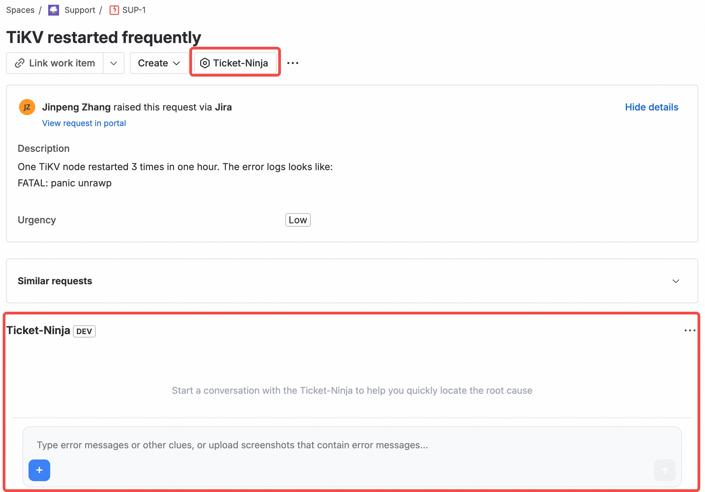

# Ticket Ninja – Jira AI Assistant (Forge + FastAPI)

This monorepo contains an Atlassian Forge app for Jira and an external AI Gateway (FastAPI) that together enable an AI assistant to analyze error logs or screenshots, retrieve similar resolved tickets or knowledge base articles, and synthesize grounded answers with citations and confidence scores.



## Structure

- `forge-app/` – Forge app (TypeScript)
  - UI (Custom UI with React) for the "AI Assistant" panel
  - Resolver functions to call Jira/Confluence and the AI Gateway
- `ai-gateway/` – External AI Gateway (FastAPI)
  - Endpoints and service stubs for Intent → Retriever → RAG → LLM
  - Screenshot parsing stub
- `docker/` – Dockerfiles

## Features

- Input: text question and/or screenshot upload (Forge Media API placeholder)
- Backend: Jira/Confluence API integration (stubs), proxy to AI Gateway
- Gateway: Intent classification, retrieval, RAG, answer synthesis stubs
- Response: AI answer, citations, confidence, KB suggestions

## Quick Start

1) Prerequisites
- Node 18+
- Python 3.10+
- Atlassian Forge CLI (`npm i -g @forge/cli`)

2) Configure environment
- Copy `ai-gateway/.env.example` to `ai-gateway/.env` and adjust as needed

3) Run AI Gateway (local)
```bash
cd ai-gateway
python -m venv .venv && source .venv/bin/activate
pip install -r requirements.txt
uvicorn app.main:app --host 0.0.0.0 --port 8000 --reload
```

4) Deploy Forge app
```bash
cd forge-app
npm install
# Login and register app if first time
forge login
forge register
# Deploy and install to your Jira site
forge deploy
forge install
```

5) Configure allowed outbound links
- In `forge-app/manifest.yml`, ensure the AI Gateway URL is listed under `permissions.external.fetch`.

## Development Notes

- UI is a minimal Custom UI React app using `@forge/bridge` to call resolver.
- Resolver proxies to the AI Gateway `/analyze` endpoint and will later add Jira/Confluence lookups.
- AI Gateway returns structured JSON: `answer`, `citations`, `confidence`, `kb_suggestions`, `debug`.

## Roadmap

- Implement real Media API upload and secure storage
- Implement Jira/Confluence retrieval and vector index (Milvus/Weaviate)
- Replace stubs with real models: miniLM/DistilBERT, embeddings, LLM
- Add authentication between Forge app and Gateway
- Observability and rate limiting
